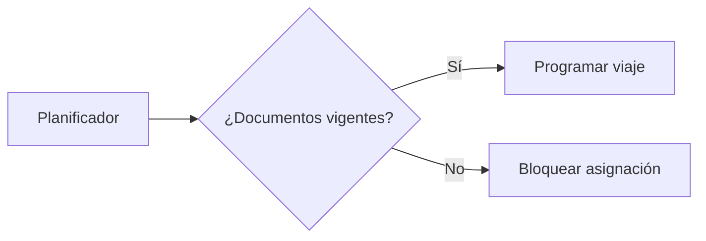

# Diagramas

Coloca aquí diagramas (archivos SVG, PNG, drawio) y una breve descripción de cada uno.

Usamos Mermaid.js para diagramas embebidos en Markdown. Ejemplos:

- `architecture.md` — Diagrama de arquitectura en Mermaid.
- `processes.drawio` — Flujos alternativos en drawio si es necesario.

Cómo trabajar con Mermaid:

- Escribe bloques fenced con el lenguaje `mermaid` dentro de archivos `.md`.
- GitHub renderiza Mermaid en Markdown; para vista previa local recomendamos la extensión **Mermaid Preview** en VS Code o el plugin `mkdocs-mermaid2-plugin` si publicas con MkDocs.

Ejemplo mínimo de bloque Mermaid:

````markdown

````
