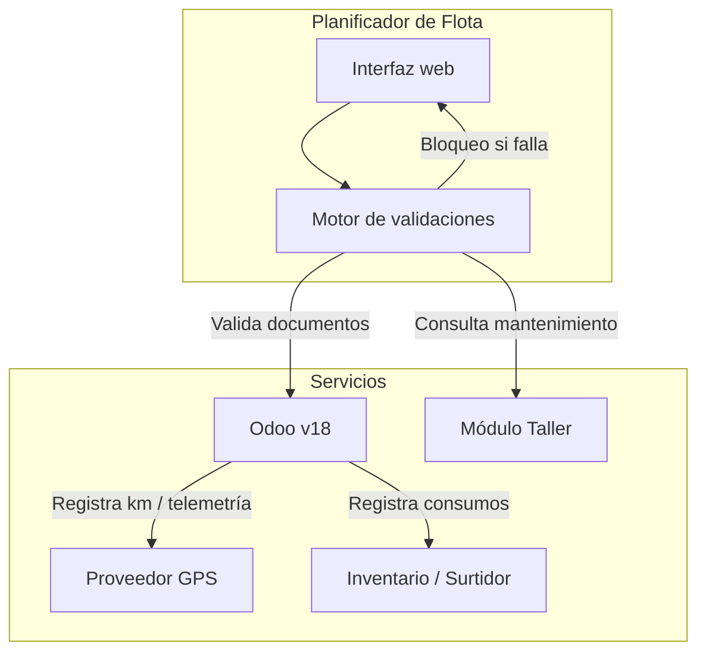

# Diagrama de Arquitectura (Mermaid)

Ejemplo de diagrama en Mermaid que representa el flujo de programación y validaciones.

```mermaid
flowchart TD
  subgraph Planner[Planificador de Flota]
    P[Interfaz web]
    V[Motor de validaciones]
  end

  subgraph Systems[Servicios]
    Odoo[Odoo v18]
    GPS[Proveedor GPS]
    Taller[Módulo Taller]
    Inventario[Inventario / Surtidor]
  end

  P --> V
  V -->|Valida documentos| Odoo
  V -->|Consulta mantenimiento| Taller
  Odoo -->|Registra km / telemetría| GPS
  Odoo -->|Registra consumos| Inventario
  V -->|Bloqueo si falla| P

``` 
